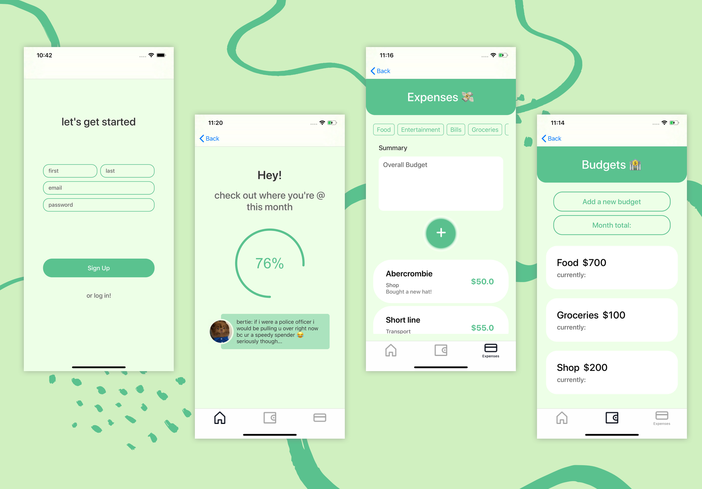
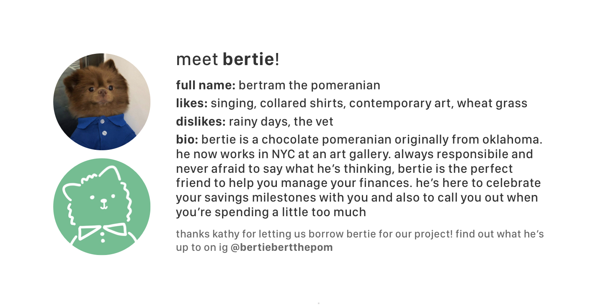

# Bertie 
### Your Budget Buddy

Only one repo used 

## A Look at the App

## About the App
### The Problem We're Tackling 
Keeping track of money is hard, so we normally take to using budgeting apps. However, all the ones we've tried so far force you to connect to your bank account and do all the expense logging for you. While this is fine for a week or so, once our drive to save money dies down a little, there's nothing to keep up going back to the app. Since the app does everything for us, as users our role is completely passive and we still don't think about our expenses any differently. Finding a good budgeting app is hard, but making our own is easy! (just jokes) 

### Our Solution
Bertie is a budgeting app that makes keeping track of your money as simple as possible. We've removed all the noise that makes expense tracking scary. Just let Bertie know how much you plan to spend for the month and each time you make an expense in that category. He'll keep track of it all for you and give you a simple overview of your progress each month. We know, logging an expense everytime you make one sounds like a lot of work, but bare with us, we're confident that this will help you become more aware of your spending, and hopefully help you stick with your budgets in the long run! 

### Who's a Good Boy !?

Bertie is the MAN (read: DOG) when it comes to money. He's not like other boys. Yes, he's good with money, but he's also good with a fun time. He's here to keep budgeting fun with little messages to encourage you, but he's also not afraid to give you a little wake up call when you're spending a little too much. 

## Meeting the Requirements
### Backend (Mandy Gang, Ray Weng)
For the backend portion of our app, we deployed it using google cloud. The database was designed with three classes: User, Expense, and Budget. In order to effectively keep track of expense and budgets, the user-expense and user-budget table was modeled a one to many relationship. In addition, Tag was initially a class in our database, however to simplify the implementation, tag was changed to be linked to both expenses and budgets which were defined simply as fields since only one tag corresponded to a budget or an expense.

### iOS (Janice Jung)
This app satisfies all the iOS requirements.

AutoLayout using NSLayoutConstraint or SnapKit
>I used SnapKit to position the elements on the screen.

At least one UICollectionView or UITableView
>There are several UICollectionViews in the app, including the filter bar for the expenses page, the UICollectionView that displays the budgets and expenses themselves. I used HeaderViews as well for the ExpensesUICollectionView and the BudgetUICollectionView.

Some form of navigation (UINavigationController or UITabBarController) to navigate between screens
>When the app is first launched UINavigationController is used to display the Sign in page and navigate between that and the Log in Page. This way the user is not able to navigate to rest of the pages until they are signed or logged in. However, when the user successfully signs in or logs in, the navigation is changed to UITabBarController and the user is given access to the rest of the app.

Integration with an API - this API must provide some meaningful value to your app. For example, if you’re creating a music app, you could use the Apple Music API. Most of you will integrate with an API written by students in the backend course.
>All users and their corresponding budgets and expenses are stored in a server that we deployed. The app then uses a lot of network calls, such as getBudget, getUsers, getExpenses, in order to display content on the pages. The users are registered and stored in the server by first and last name, email and password. When the user logs in, the user_id corresponding to the user is is stored and used to get all the information stored related to that user by get method calls. Budgets and expenses can also be edited by using post calls and deleted by delete calls.

## A Note to the Grader
Frontend-wise, Janice used a Cocoa-pod to create the circular progress wheel that displays how much of your total budget that you have used. The more expenses you add, the closer you get to your final budget. The messages that our mascot, Bertie the dog, says on the homepage were supposed to change as you got closer and closer to the budget limit but unfortunately was not able to implement it as we ran out of time. 

There are many features that we brainstormed for this app that were not implemented due to time-constraints so please take a look at the prototypes and screens in the Screens folder that our designer made to get a glimpse of our app at its full potential!

